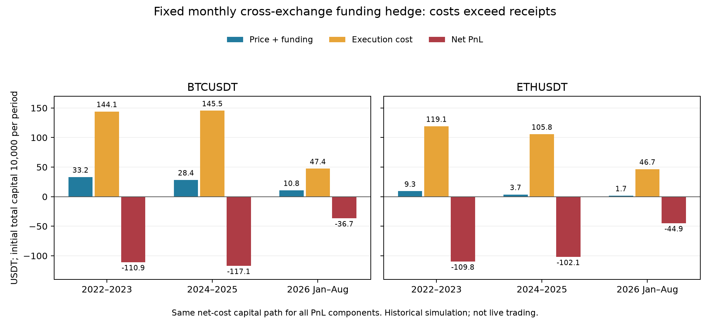

# 다른 원리의 Edge 조사 — 2026-09-12

결론은 **만기 선물–무기한 선물의 가격 수렴을 다음 검증 후보로 올리는 것**입니다.
Binance–Bybit 펀딩 차이는 전체 데이터를 확보해 고정 규칙 1개를 실제 백테스트했지만
현재 거래비용에서 탈락했습니다. 옵션 위험 프리미엄과 예정된 토큰 공급 증가는
경제 원리는 다르지만, 현재 확보한 자료만으로 체결 가능한 수익을 판정할 수 없습니다.
새 PASS/SHADOW는 없습니다. 기존 3개 SHADOW와 자동화 설정은 변경하지 않았습니다.

## 후보 비교

| 후보 | 경제 원리 | 이번에 직접 확보·확인한 증거 | 상태 | 다음 조건 |
| --- | --- | --- | --- | --- |
| 만기 선물 매도 + 동일 자산 perp 매수 | 정산일이 있는 선물 프리미엄의 수렴과 실제 perp 펀딩 비용의 차이 | Binance BTC/ETH 각 24개 만기 심볼 목록, 2022~2026 표본 ZIP 10개 체크섬/내부 간격 확인, 자산별 정산가격 18건 | **NEXT — 수익성 미검증** | 정산 사건 시각·계약 사양·롤/상장 이력과 전체 공통 가격 검증 |
| Binance–Bybit 동일 자산 펀딩 차이 | 서로 다른 거래소 참가자의 레버리지 수요와 자본 이동 제약 | 4개 venue-asset 조합의 가격 각 41,640시간, 정산 각 5,205건; 고정 월간 규칙 실측 백테스트 | **REJECTED** | 동일 lookback/hold/fee 사후 튜닝 금지 |
| 델타헤지 옵션 매도 | 급변·변동성 위험을 인수하는 대가 | 원논문, Deribit 과거 체결·DVOL·상품목록 API 표본 확인 | **BLOCKED-DATA — 수익성 미검증** | 과거 옵션/헤지 bid-ask·잔량·상품 체인·증거금 자료 |
| 예정된 토큰 언락 공급 효과 | 처분 제한 해제와 수령자 행동에 관한 정보 | ARB 공식 계약/거버넌스·OP 공급 문서, 사건 공개시각과 실제 release의 구분 | **BLOCKED-DATA — 수익성 미검증** | 당시 공개된 일정 버전, 매도 가능량, 상폐 포함 universe 및 실제 거래가능성 |

이 후보들은 기존 momentum에 필터를 더 붙이는 방식이 아닙니다. 다만 원리가 달라도
서로 완전히 독립적인 손익이나 분산효과를 보장하지 않습니다. 아래는 자료·가정·실행
결과를 구분한 조사이며, 논문의 큰 수익률을 우리 전략 성적으로 옮겨 적지 않았습니다.

## 1. Binance–Bybit 펀딩 차이: 자료는 통과, 거래 가능한 Edge는 탈락

### 자료와 사전등록

공식 Bybit V5는 펀딩 이력과 거래/마크가격 캔들을 제공하며, 펀딩 간격은 상품별로
다를 수 있습니다. 따라서 8시간 간격을 먼저 가정해 빈칸을 0으로 채우지 않고 실제
이력의 시간 격자를 검사했습니다. [S2–S4]

**OBSERVED** — Bybit 원본 응답 222페이지를 저장하고 endpoint/query/조회시각/로컬
SHA256을 남겼습니다. API retCode, linear 시장 종류와 심볼을 모두 확인했습니다.
기존 Binance 공식 ZIP 349개의 기록된 SHA256도 재검증했습니다. Bybit 로컬 SHA256은
관측 보존용이며 거래소 발행 체크섬과 동일한 인증을 뜻하지 않습니다.

| 자산·거래소 | 거래가격 시간봉 | 마크가격 시간봉 | 실제 펀딩 정산 | 거래량 0 시간 |
| --- | ---: | ---: | ---: | ---: |
| BTC Binance | 41,640 | 41,640 | 5,205 | 1 |
| BTC Bybit | 41,640 | 41,640 | 5,205 | 0 |
| ETH Binance | 41,640 | 41,640 | 5,205 | 1 |
| ETH Bybit | 41,640 | 41,640 | 5,205 | 0 |

기간은 2021-12-01~2026-08-31, December 2021은 사전 신호 context입니다.
전체 가격·펀딩 격자에서 누락/중복/시각 오정렬이 없었습니다. 2024-07-01의 6개
독립 재요청(두 자산 × 세 endpoint), 총 102개 관측값도 캐시와 일치했습니다.
같은 거래소에 대한 재요청이므로 독립적인 두 공급자 검증이라고 부르지는 않습니다.

규칙은 `docs/cross-exchange-prereg-2026-09-12.md`, commit `b6b65f0`로 전체 Bybit
시계열 다운로드와 포트폴리오 수익 계산 전에 고정했습니다. 이전 18개 요청은
표본 접근 검사였으며 전체 데이터 검증 또는 수익성 검증이 아니었습니다.

### 고정 가설과 회계

**ASSUMED** — 이전 7개의 완성 UTC 날짜에서 실제 정산 펀딩 합이 더 높은 거래소를
매도하고 다른 거래소를 매수합니다. 매월 첫날 01:00 진입, 마지막 날 23:00 청산,
동일 base 수량을 월중 유지합니다. 이전 합이 같으면 cash이며 현재 월 펀딩은 진입
판단에 쓰지 않습니다. 하나의 규칙만 검증했고 threshold/window 탐색은 없습니다.

각 거래소의 현금은 5,000 USDT에서 시작합니다. 거래소 사이 이익을 무료로 옮겨
담보로 사용하지 않습니다. 수량은 작은 쪽 현금과 높은 쪽 진입가격으로 제한합니다:
`q = 0.40 × min(wallets) / max(entry_prices)`. 처음의 총 gross 노출은 약 40%이며,
양 거래소의 현금이 벌어지면 다음 달의 수량도 줄어듭니다.

가정한 편도 비용은 Binance 5bp, Bybit 5.5bp 수수료와 각각 2bp 기본 슬리피지,
이전 완성 봉 range/open ×0.02입니다. 한 leg 원금 기준 기본 왕복 비용은 **29bp**이며
변동 슬리피지가 추가됩니다. 계정의 실제 VIP 수수료를 확인했다는 주장은 아닙니다.

실제 정산 순간에만 `-side × q × 각 거래소 mark_open × actual_rate`를 반영합니다.
두 거래소의 지갑·미실현손익·증거금 최악 방향을 따로 계산합니다. 결합 NAV가 양수여도
한 거래소의 담보가 부족하면 통과시키지 않습니다. 이런 자본·증거금 제약은 carry가
단순한 무위험 수익이 되지 못하는 주요 이유로 기존 연구에서도 다룹니다. [S1, S5]

### 실제 백테스트 판정

**DERIVED FROM OBSERVED DATA UNDER THE REGISTERED MODEL** — 계좌 시작금 10,000 USDT,
월간 고정 헤지의 기간 누적수익률입니다. 연율 수익이나 실거래 성과가 아닙니다.

| 자산 | 2022~2023 | 2024~2025 | 2026-01~08 | 완료 월간 cycle |
| --- | ---: | ---: | ---: | --- |
| BTC | -1.109% | -1.171% | -0.367% | 23 / 24 / 8 |
| ETH | -1.098% | -1.021% | -0.449% | 21 / 24 / 8 |

6/6 primary 및 10/10 자연연도 구간이 모두 음수입니다. 동률 때문에 BTC discovery
1개월, ETH discovery 3개월은 현금이었으며 시간 격자에서 삭제하지 않았습니다.
거래 불가 진입/청산 생략 0, 25% 담보 게이트 위반 0입니다. primary 최소 담보/원금
비율은 약 1.152였으므로 이번 탈락은 증거금 강제청산이 아니라 비용 대비 수입 부족입니다.

같은 월·방향의 **실행비용 0 진단**은 BTC +0.334% / +0.286% / +0.108%,
ETH +0.093% / +0.037% / +0.017%였습니다. 자본 경로는 비용 제거에 따라 달라지므로
그 gross 금액을 원래 경로의 비용과 직접 빼서 계산하지 않았습니다.

실제 net 경로의 BTC 2024~2025 예:
가격 PnL +1.14 + 펀딩 PnL +27.25 − 실행비용 145.49 = **−117.10 USDT**.
ETH 같은 기간은 −1.41 + 5.11 − 105.77 = **−102.06 USDT**입니다.

이 결과는 두 대형 거래소의 BTC/ETH에서 이 고정 규칙의 funding carry가 작은 양수여도
수수료·슬리피지를 감당하지 못한다는 증거입니다. 모든 거래소·토큰·실행 방식에 대해
보편적으로 기회가 없다는 결론은 아닙니다. 그렇다고 이번 성적을 보고 수수료를 낮추거나
lookback/holding을 재검색하지 않습니다. **REJECTED, parameter trial 1개 종료.**

BIS의 현물–만기선물 carry 수익률과 우리의 CEX–CEX perpetual funding 차이는
동일 상품·전략이 아닙니다. 또 일부 funding 연구는 짧은 표본과 분 단위 연속 accrual
모형을 사용합니다. 거래소의 실제 정산 규칙·자본·비용을 적용한 우리의 수익률로
그 논문 수치를 대체할 수 없습니다. [S1, S5]

## 2. 다음 우선순위: 만기 선물–perp 가격 수렴

**OBSERVED, SAMPLE ONLY** — Binance에서 BTC/ETH 각각 2021~2026 만기 심볼 24개를
열거할 수 있습니다. 2022~2026 각 연도의 양 자산 ZIP 10개를 실제로 열어 SHA256과
표본 내부 1h 간격을 확인했습니다. 정산가격 API는 자산별 18회, 2022-03-25부터
2026-06-26까지 반환했습니다. 미래 만기의 가격이나 정산을 성과 표본으로 세지 않습니다. [S6]

이 방식은 현물 가격을 쓰지 않으며, 앞서 막혔던 2023-03-24 13:00 UTC에도 해당
BTC/ETH 만기선물 원본에 실제 거래량이 있는 행이 있었습니다. 이는 별도 데이터 계약을
검증할 근거이며, 기존 spot/perp 데이터 게이트를 낮출 이유는 아닙니다.

경제적 손익은 대략 다음 구성입니다. [S1, S7]

`최초 만기선물−perp 가격차 + 청산 perp−정산지수 차이 − 지급 펀딩 − 실행·정산 비용`

만기선물의 정산지수와 perp의 실제 청산가격은 같다고 보장되지 않습니다.
만기 프리미엄이 미래 펀딩과 위험 비용을 이미 반영한다는 것이 가장 강한 반론입니다.

**UNRESOLVED** — 정산 API 표본 시각은 만기일 00:00 UTC인데 일반 안내의 실제
정산은 08:00 UTC입니다. 2024년 표본에는 08시 거래와 09시 거래량 0인 봉도 있습니다.
날짜 라벨·실제 settlement·마지막 거래 가능 시각을 구분하기 전 마지막 봉을 정산가로
대체하지 않습니다. 과거 계약 사양과 상장/롤 예외, 전 기간 공통 데이터도 더 확인해야 합니다.

따라서 **NEXT**입니다. 데이터 계약이 완성되면 동일 자산·결제통화의 고정 만기 접근
규칙 1개를 사전등록해 시험합니다. 현재 수익성 trial은 0회이며, 18번 만기를 수만 개의
독립 시간봉 표본처럼 해석하지 않습니다.

## 3. 옵션 변동성 위험 프리미엄

**SOURCE EVIDENCE** — 옵션 보험 수요가 지불하는 변동성/점프 위험 보상을
델타헤지한 매도자가 받는가라는 가설입니다. 기존 volatility breakout이나 모멘텀
변동성 필터와 다릅니다. Lucic·Sepp의 원논문 초록과 별도의 Deribit 체결 연구는
델타헤지 옵션 손익과 유동성/비용의 중요성을 다룹니다. 모든 옵션 매도가 이익이라는
증거나 본 프로젝트의 재현 결과는 아닙니다. [S8–S9]

공식 Deribit 공개 API에서 BTC/ETH DVOL, 만기 옵션 과거 체결과 상품목록 표본을
조회할 수 있습니다. 그러나 현재 `get_order_book`의 bid/ask·Greeks가 과거 옵션
주문장 전체를 복원해 주지는 않습니다. DVOL은 보간된 변동성 지수이므로
`내재분산−사후 실현분산`을 계산해도 매도 bid부터 출발한 옵션 전략 PnL과 같지 않습니다. [S10–S12]

Deribit inverse option은 코인 단위 결제이므로 옵션 delta 외 담보의 USD 노출과
결제 중 delta decay도 다뤄야 합니다. 델타헤지는 점프·감마·베가 위험을 제거하지 않습니다. [S10]

**BLOCKED-DATA** — 동기화된 역사 옵션/헤지 bid-ask·잔량·상품 체인·Greeks 입력과
당시 증거금·비용 계약이 부족합니다. Tardis는 Deribit 역사 옵션 체인 및 주문장 자료와
일부 무료 표본을 문서화하지만, 연속 접근과 모든 필요한 상품의 권한·완전성을 아직
검증하지 않았습니다. 구매나 인증정보 사용은 하지 않았습니다. [S13]

## 4. 예정된 토큰 공급 증가

**SOURCE EVIDENCE** — 알려진 처분 제한 해제와 보유자의 행동이 매도 가능한 공급과
가격에 주는 영향을 시험합니다. 언락 예정량, vesting 완료, 실제 release, 추가 제한 없는
유통량, 실제 매도량은 서로 다른 필드여야 합니다. 거래소 입금도 매도 증거로 쓰지 않습니다.

ARB 공식 자료에서 팀·투자자 첫 언락 2024-03-16과 재단의 2023-04-17 이후 연속
vesting은 별개입니다. 재단 계약은 release 호출 및 DAO 변경 가능성이 있어 달력의
예정량을 자동 매도량으로 대체할 수 없습니다. OP 공식 설명도 공급 예시와 실제
circulating/committed 구분을 강조합니다. [S14–S16]

**BLOCKED-DATA** — 과거 시점에 공개된 일정 버전, 계약 상태와 실제 지급,
매도 제한 여부, 당시 상장·상폐 포함 universe가 아직 완성되지 않았습니다. 현재
생존한 유명 토큰의 현재 스프레드시트로 과거 사건을 고르면 미래정보/생존편향이 생깁니다.
연속 재단 vesting과 팀·투자자의 불연속 cliff도 같은 사건으로 묶지 않습니다.

ICO resale restriction과 장기 성과를 분석한 논문이나 언락 사건을 다룬 학위논문은
설계 참고입니다. 비용을 포함한 단기 거래 Edge를 우리 데이터로 입증한 결과는 아닙니다. [S17]

## 검증·범위

연구 4축, 독립 자료조사 작업자 3명과 실행기 구현 작업자 1명으로 진행했습니다.
Exa 검색 18회에서 요청한 결과 97건(중복 포함)을 대상으로 공식 자료와 원논문을
우선 확인했습니다. 검색 결과 수는 독립적으로 입증된 주장 수가 아닙니다.
세 보조 후보는 데이터/계약 조사이며 금융 백테스트 0회입니다.

실제 Binance–Bybit trial은 1개이고, 비용 0 진단은 파생 결과입니다.
전체 테스트 307개, 변경 파일 타입 검사·ruff 및 패키지 빌드 통과.
실제 CLI 실행과 재현, 손익 합계와 최종 NAV 일치, 미래 펀딩 미사용, 독립 담보,
현재 시점 API 재조회, source 메타데이터를 확인했습니다. 그래프는 실제 CSV로 만들고
렌더링을 확인했습니다. 초기 legend 중첩은 수정했습니다.

원본/상세 증거: `artifacts/edge_search/cross_exchange_research/`의
`bybit_response_manifest.csv`, `data_quality.csv`, `overlapping_api_verification.csv`,
`cross_exchange_results.csv`, `annual_primary_results.csv`, `*_cycles.csv`,
`*_equity.parquet`, `notes/*.md`, `frozen_shadow_before.sha256`.

## 주요 출처

모든 접근일은 2026-09-12입니다. 링크의 논문 수익률을 본 프로젝트 성적으로 인용하지 않습니다.

- [S1] Schmeling, Schrimpf, Todorov. Crypto carry, BIS WP1087, revised October 2025. https://www.bis.org/publ/work1087.htm
- [S2] Bybit, Get Funding Rate History. https://bybit-exchange.github.io/docs/v5/market/history-fund-rate
- [S3] Bybit, Get Kline. https://bybit-exchange.github.io/docs/v5/market/kline
- [S4] Bybit, Get Mark Price Kline. https://bybit-exchange.github.io/docs/v5/market/mark-kline
- [S5] Zhivkov, The Two-Tiered Structure of Cryptocurrency Funding Rate Markets (8-day panel). https://doi.org/10.3390/math14020346
- [S6] Binance public data and delivery observations. https://github.com/binance/binance-public-data ; https://fapi.binance.com/futures/data/delivery-price?pair=BTCUSDT ; https://fapi.binance.com/futures/data/delivery-price?pair=ETHUSDT
- [S7] Ackerer, Hugonnier, Jermann. Perpetual Futures Pricing. https://www.nber.org/system/files/working_papers/w32936/w32936.pdf (research-worker access; parent web fetch was blocked)
- [S8] Lucic, Sepp. Valuation and hedging of cryptocurrency inverse options. https://www.tandfonline.com/doi/full/10.1080/14697688.2024.2364804 (abstract/notes verified, full cost assumptions unresolved)
- [S9] Atanasova et al. Illiquidity Premium and Crypto Option Returns. https://acfr.aut.ac.nz/__data/assets/pdf_file/0006/969378/950002_Atanasova_Illiquidity-Premium-and-Crypto-Option-Returns.pdf
- [S10] Deribit option/hedge contract. https://support.deribit.com/hc/en-us/articles/31424939096093-Inverse-Options ; https://support.deribit.com/hc/en-us/articles/25944751433757-Delta-decay-during-settlement
- [S11] Deribit book and data APIs. https://docs.deribit.com/api-reference/market-data/public-get_order_book ; https://docs.deribit.com/articles/options-data-collection-best-practices
- [S12] Deribit DVOL construction. https://insights.deribit.com/exchange-updates/dvol-deribit-implied-volatility-index/
- [S13] Tardis Deribit data contract/access. https://docs.tardis.dev/historical-data-details/deribit ; https://docs.tardis.dev/downloadable-csv-files/data-types ; https://docs.tardis.dev/faq/billing-and-subscriptions
- [S14] Arbitrum official supply and AIP-1.1. https://docs.arbitrum.foundation/token-supply ; https://forum.arbitrum.foundation/t/proposal-aip-1-1-lockup-budget-transparency/13360
- [S15] Arbitrum Foundation vesting implementation/history. https://github.com/ArbitrumFoundation/governance/pull/44 ; https://github.com/ArbitrumFoundation/governance/blob/ce6b919ce4f3dda33bd3627616c89fb2600ab072/src/ArbitrumFoundationVestingWallet.sol
- [S16] Optimism supply clarification/budget. https://gov.optimism.io/t/clarification-on-op-token-supply/5589 ; https://gov.optimism.io/t/foundation-mid-year-budget-update/7295
- [S17] Fuchs, Momtaz, token resale restrictions. https://link.springer.com/article/10.1007/s11187-024-00945-9 ; Kurovskiy, Essays in Macroeconomics and FinTech. https://doi.org/10.5075/epfl-thesis-10982 (unlock chapter abstract only)

## 기존 SHADOW 자동화 첫 실행 확인

2026-09-12 16:12 KST 자동 작업 기록의 refresh exit 0과, 결과 CSV의 실제 갱신 시각
16:12:36을 대조했습니다. BTC/ETH 1h 각 1개 추가, 최신 06:00 UTC; 4h 최신
00:00 UTC입니다. 세 전략 모두 TRACKING이며 설정 모델은 gpt-5.6-luna, ACTIVE입니다.
이는 예약 등록만 확인한 이전 단계에서 실제 데이터 갱신까지 확인한 결과입니다.
기존 7개 전략/추적 source SHA256은 자동 실행 후에도 동일합니다.

조사 시작부터 증거 묶음 기록까지 36.7분. 출처 목록은 고유 URL 27개, 호스트 16개입니다. 호스트 수가 독립 연구 수를 뜻하지는 않습니다.
구현 commit: `d7ab44d90855056142358b20574959e333032771`. 기계 판독 근거: `docs/edge-evidence-2026-09-12-cross-exchange.json`.
